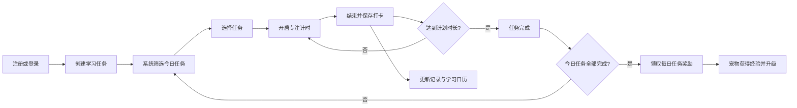
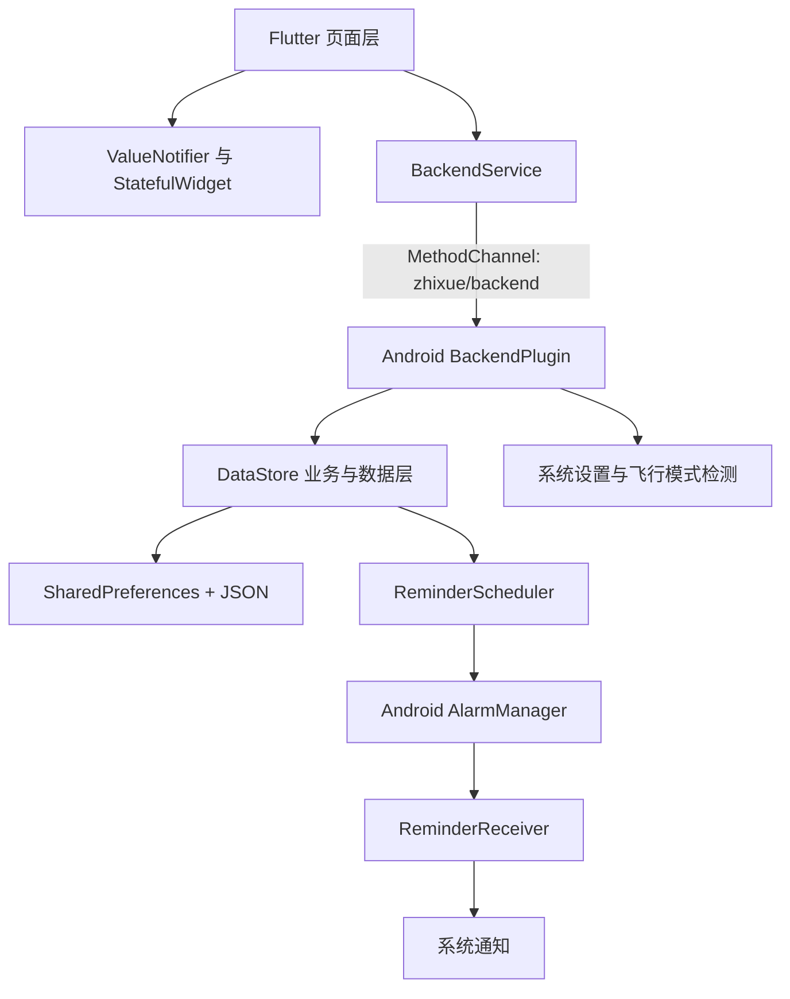

<p align="center">
  
</p>

<h1 align="center">至学</h1>

<p align="center">
  一款将学习计划、专注计时、打卡反馈与宠物成长结合起来的 Flutter 学习管理应用。
</p>

## 项目简介

“至学”面向需要建立稳定学习节奏的学生和自主学习者。它不是单纯的待办清单，而是围绕每日学习行为设计了一套完整闭环：

1. 用户创建长期或阶段性学习计划。
2. 系统根据日期范围和每周重复规则生成今日任务。
3. 用户选择任务并进入专注计时。
4. 每次专注结束后记录实际学习时长，多次记录可累计。
5. 达到计划时长后任务完成，并进入日历和进度统计。
6. 完成签到或全部今日任务可获得经验，推动宠物成长。
7. 定时通知提醒用户按计划开始学习。

项目采用“Flutter 界面 + Android Java 本地后端”的实现方式。业务数据保存在设备本地，不依赖网络服务，适合作为移动应用课程设计、Flutter 综合实践或本地优先应用原型。

当前版本：`1.0.0+1`

## 产品特点

### 计划驱动

学习任务包含名称、起止日期、每日学习时段和每周执行日。系统只展示当天真正需要执行的任务，避免长期计划堆积在首页。

### 专注计时

用户从今日任务中选择一项开始计时，可以暂停、继续或结束。计时结果会累加到该任务当天的完成进度中，因此一个任务可以分多次学习完成。

### 正向反馈

应用通过每日签到、任务奖励、连续打卡、宠物经验和等级，将抽象的学习成果转换为可见反馈。宠物支持小猫和小狗两种形态，并带有待机、进食动画。

### 本地优先

账号、计划、打卡、宠物和提醒设置均保存在 Android 本地。应用无需部署服务器，也不需要配置数据库或 API 密钥即可运行。

### 中文体验

应用默认使用简体中文，并配置了 Flutter 中文本地化代理，同时保留繁体中文和英文 Locale 支持。

## 核心使用流程



## 页面与功能

应用主界面采用“首页、宠物互动、我的”三个底部入口，并通过二级页面承载计划、计时、记录和设置功能。

### 1. 启动与账号

- 启动页至少展示 2.5 秒，同时尝试恢复本地登录状态。
- 登录成功后保存 Session，下次启动可自动进入主界面。
- 支持手机号或邮箱注册。
- 注册时检查账号是否重复。
- 密码至少 8 位，并要求达到中等强度，即至少包含两类字符。
- 注册时可同时设置用户昵称和宠物昵称。
- 退出登录会清除当前 Session，但不会删除该账号的本地任务和打卡数据。

首次启动会自动写入一个演示账号：

```text
账号：test
密码：123456
昵称：至学学员
默认宠物：小猫
```

### 2. 首页

首页用于展示当天最重要的信息和操作：

- 根据当前时间显示早晨、下午或晚间问候。
- 展示日期和随机学习激励语。
- “开始学习打卡”按钮进入今日任务选择页。
- 展示今日任务总数、已完成数量和整体完成率。
- 展示每项任务的名称、完成状态和当日进度。
- 今日没有任务时，可直接跳转到新建任务页。
- 有任务但尚未全部完成时，引导继续完成任务。
- 全部任务完成后，可领取每日任务奖励。

### 3. 学习计划

新建任务时需要填写：

| 字段 | 说明 |
| --- | --- |
| 任务名称 | 例如“英语单词背诵”“高数刷题练习” |
| 开始日期 | 任务生效日期，不早于当天 |
| 结束日期 | 任务截止日期 |
| 开始时间 | 每次计划学习的开始时刻 |
| 结束时间 | 每次计划学习的结束时刻 |
| 每周执行日 | 周一至周日，可多选，至少选择一天 |

“我的学习计划”页面展示全部计划的日期范围、每日时段和整体完成进度，并支持下拉刷新。

整体计划进度不是简单按打卡次数计算，而是：

```text
整体进度 = 已达到计划时长的执行日数量 / 截至今天应执行的日期数量
```

### 4. 今日任务与专注模式

系统会同时检查任务的日期范围和星期规则，只把当天应执行的任务加入今日列表。

进入任务选择页后：

- 可选择任意一项今日任务。
- 已完成任务会显示完成标记。
- 可选择是否启用“专注勿扰模式”。
- 选中任务后才能进入计时页。

计时页面提供：

- 本次专注计时。
- 开始、暂停和继续。
- 计划时段及计划总时长。
- 今日累计学习时长。
- 当前任务完成百分比。
- 结束打卡并保存记录。

开启勿扰模式后，在结束打卡前会阻止通过返回键退出计时页面。普通 Android 应用无法静默修改系统飞行模式，因此涉及飞行模式的操作会跳转系统设置，由用户手动确认。

### 5. 打卡、进度与日历

每次结束计时都会生成一条独立打卡记录。同一任务在同一天可以产生多条记录，系统会将这些记录的时长累加：

```text
当日任务进度 = 当日累计学习秒数 / 计划学习秒数
```

进度最高显示为 100%。当累计学习时长达到计划时长时，该任务被判定为完成。结束时间早于开始时间时，会按跨午夜时段计算。

数据展示包括：

- 首页今日任务进度。
- 全部学习计划的阶段进度。
- 历史打卡明细。
- 月度学习日历。
- 每日累计学习分钟数。
- 每日参与学习的任务名称。
- 连续签到天数。

### 6. 每日签到与宠物成长

中间的宠物页面是应用的激励中心：

- 支持小猫、小狗两种宠物。
- 宠物拥有名称、经验和等级。
- 使用本地 MP4 资源展示待机与进食动画。
- 页面离开或应用进入后台时自动暂停视频，降低无效播放。
- 每日签到独立于学习任务，每天只能完成一次。
- 完成签到后增加宠物经验并更新连续签到天数。
- 今日所有任务完成后，可以额外领取一次任务奖励。

当前持久化奖励规则：

| 行为 | 条件 | 奖励 |
| --- | --- | --- |
| 每日签到 | 当天尚未签到 | `+20` 宠物经验 |
| 每日任务奖励 | 今日存在任务、全部完成且尚未领取 | `+20` 宠物经验 |
| 宠物升级 | 当前经验达到 100 | 等级 `+1`，扣除 100 经验 |

签到和任务奖励分别计算，互不替代。连续天数依据每日签到记录计算，而不是依据学习任务打卡记录计算。

### 7. “我的”页面

“我的”页面集中展示个人信息与学习数据：

- 用户头像、昵称和账号。
- 新建学习任务入口。
- 全部学习计划入口。
- 历史打卡记录入口。
- 提醒设置入口。
- 学习打卡月历。
- 选中日期的学习分钟数和任务列表。
- 随机 AI 学习提示。

当前“至学 AI 学习助手”为提示展示区域，尚未接入真实对话模型或远程 AI 服务。

### 8. 账号与宠物设置

账号信息页支持：

- 从系统相册选择头像。
- 将头像复制到应用文档目录，保存持久文件路径。
- 修改用户昵称。
- 在小猫和小狗之间切换宠物。
- 修改宠物昵称。
- 查看账号 ID、宠物等级和连续签到天数。
- 退出当前账号。

用户昵称最多输入 10 个字符，宠物昵称最多输入 8 个字符。

### 9. 学习提醒

提醒设置包括：

- 总提醒开关。
- App 内提醒开关。
- 手机通知横幅开关。
- 每日统一提醒时间。
- 每个学习任务开始时间提醒。

Android 原生层通过 `AlarmManager` 调度提醒，通过 `BroadcastReceiver` 接收定时事件，并使用高优先级通知渠道展示通知。保存设置、登录、恢复 Session 或创建任务后都会重新调度提醒。

提醒的设计规则：

1. 在用户设置的每日统一时间发送“学习时间到啦”。
2. 在每项学习任务的计划开始时间发送任务提醒。
3. 如果目标时间已经过去，则寻找下一次符合任务日期和星期规则的时间。
4. Android 12 及以上版本缺少精确闹钟能力时，会回退到非精确定时。
5. Android 13 及以上版本需要用户授予通知权限。

目前系统通知横幅已经接入原生实现；App 内提醒开关已保存到设置，但独立的应用内弹窗调度仍属于预留能力。

## 业务规则

### 今日任务判定

任务需要同时满足以下条件：

```text
开始日期 <= 今天 <= 结束日期
并且
今天的 ISO 星期值包含在任务 week_days 中
```

星期值采用 `1-7`，分别表示周一至周日。

### 任务完成判定

```text
计划时长 = 结束时间 - 开始时间
当日实际时长 = 同账号 + 同任务 + 同日期下所有打卡时长之和
任务完成 = 当日实际时长 >= 计划时长
```

如果计划结束时间不晚于开始时间，系统将任务视为跨午夜任务，并补加 24 小时。

### 奖励判定

任务奖励按钮只有在今日存在任务时显示。全部今日任务达到计划时长后才能领取，且同一账号每天只能领取一次。

### 连续签到

连续天数以今天为起点向前检查签到日期。如果今天尚未签到，则从昨天开始计算已有连续记录。

## 技术架构



### Flutter 页面层

页面使用 `StatefulWidget` 管理局部交互状态，使用全局 `ValueNotifier` 同步登录状态、用户资料、宠物信息和连续签到天数。主页面通过 `IndexedStack` 保留三个底部页面的状态。

### 通信层

`lib/services/backend_service.dart` 对 `MethodChannel` 调用进行统一封装。通道名称为：

```text
zhixue/backend
```

Flutter 侧只处理 Map、List 和基础类型，Android 侧负责把 `JSONObject`、`JSONArray` 递归转换为 Flutter 可识别的数据结构。

### Android 业务层

- `BackendPlugin`：接收 Flutter 方法调用、检查登录状态并分发业务。
- `DataStore`：负责账号、任务、打卡、奖励、宠物和设置的业务逻辑。
- `DateUtils`：负责日期格式、星期判断和连续签到计算。
- `ReminderScheduler`：创建、取消和重新安排定时提醒。
- `ReminderReceiver`：在定时事件触发后发送系统通知。

## MethodChannel 接口

| 分类 | 方法 | 用途 |
| --- | --- | --- |
| 初始化 | `init` | 初始化本地数据和演示账号 |
| 账号 | `login` | 登录并返回完整用户资料 |
| 账号 | `register` | 注册本地账号 |
| 账号 | `accountExists` | 检查账号是否重复 |
| 账号 | `restoreSession` | 恢复上次登录状态 |
| 账号 | `logout` | 清除当前 Session |
| 任务 | `getTodayTasks` | 获取今日应执行任务 |
| 任务 | `getAllTasks` | 获取当前用户全部任务 |
| 任务 | `createTask` | 创建学习任务 |
| 打卡 | `addCheckin` | 保存一次专注记录 |
| 打卡 | `getCheckinRecords` | 获取历史打卡记录 |
| 打卡 | `getCalendarData` | 获取指定月份聚合数据 |
| 打卡 | `getStreak` | 获取连续签到天数 |
| 打卡 | `clearTodayCheckins` | 清除今日全部或指定任务记录 |
| 奖励 | `getRewardStatus` | 获取签到和任务奖励状态 |
| 奖励 | `claimDailyReward` | 领取每日任务经验 |
| 奖励 | `signIn` | 完成每日签到 |
| 宠物 | `getPetInfo` | 获取宠物资料 |
| 宠物 | `updatePet` | 修改宠物类型或昵称 |
| 资料 | `getProfile` | 获取用户综合资料 |
| 资料 | `updateProfile` | 修改昵称或头像 |
| 提醒 | `getReminderSettings` | 获取提醒配置 |
| 提醒 | `saveReminderSettings` | 保存配置并重新调度 |
| 权限 | `hasNotificationPermission` | 检查系统通知权限 |
| 权限 | `openNotificationSettings` | 打开应用通知设置页 |
| 系统 | `isAirplaneModeOn` | 检查飞行模式状态 |
| 系统 | `setAirplaneMode` | 尝试切换或打开飞行模式设置 |

## 本地数据设计

数据保存在名为 `zhixue_store` 的 `SharedPreferences` 文件中。复杂对象以 JSON 字符串存储。

| Key | 内容 |
| --- | --- |
| `initialized` | 是否完成首次初始化 |
| `users` | 用户账号、密码和昵称 |
| `tasks` | 全部用户的学习任务 |
| `checkins` | 专注计时生成的打卡记录 |
| `reward_log` | 每日任务奖励领取记录 |
| `signin_log` | 每日签到记录 |
| `pet_<account>` | 指定账号的宠物资料 |
| `profile_<account>` | 指定账号的昵称和头像 |
| `remind_<account>` | 指定账号的提醒配置 |
| `session` | 当前登录账号和密码 |

### 主要数据结构

```text
User
  account
  password
  nickname

Task
  id
  owner
  name
  start_date
  end_date
  start_time
  end_time
  week_days[]
  created_at

Checkin
  id
  owner
  task_id
  task_name
  date
  duration_seconds
  created_at

Pet
  owner
  pet_type
  pet_name
  pet_exp
  pet_level

ReminderSettings
  remindEnabled
  inAppRemind
  bannerRemind
  remindTime
```

所有业务数据按 `owner` 字段隔离。卸载应用或清除应用数据会删除账号及其全部学习数据。

## 技术栈与依赖

| 技术 | 当前用途 |
| --- | --- |
| Flutter 3.44.2 | 跨平台界面和交互 |
| Dart 3.12.2 | Flutter 业务代码 |
| Material 3 | 主题和基础组件 |
| Java 17 | Android 原生后端 |
| MethodChannel | Flutter 与 Android 通信 |
| SharedPreferences | 本地持久化 |
| AlarmManager | 学习提醒调度 |
| `video_player` | 宠物待机和进食动画 |
| `image_picker` | 从相册选择头像 |
| `path_provider` | 获取应用文档目录 |
| `flutter_localizations` | 中文日期与组件本地化 |

项目不依赖远程接口、第三方登录、云数据库或状态管理框架。

## 项目结构

```text
zhixue/
├── lib/
│   ├── main.dart                    # 应用入口、全局状态、启动页、主导航
│   ├── login_page.dart              # 登录页面
│   ├── register_page.dart           # 注册和表单校验
│   ├── home_page.dart               # 首页、今日任务、任务奖励
│   ├── task_create_page.dart        # 创建学习任务
│   ├── task_select_page.dart        # 选择今日任务和勿扰模式
│   ├── study_timer_page.dart        # 专注计时与打卡
│   ├── study_plan_page.dart         # 全部学习计划
│   ├── checkin_record_page.dart     # 历史打卡明细
│   ├── supervise_setting_page.dart  # 学习提醒设置
│   ├── add_page.dart                # 宠物、签到和经验奖励
│   ├── mine_page.dart               # 用户中心和学习日历
│   ├── account_page.dart            # 账号、头像和宠物设置
│   └── services/
│       └── backend_service.dart     # MethodChannel 调用封装
├── android/app/src/main/java/com/example/zhixue/
│   ├── MainActivity.java            # Flutter 引擎配置和通知权限
│   └── backend/
│       ├── BackendPlugin.java       # 原生方法分发
│       ├── DataStore.java           # 本地数据和业务规则
│       ├── DateUtils.java           # 日期计算
│       ├── ReminderScheduler.java   # AlarmManager 提醒调度
│       └── ReminderReceiver.java    # 通知广播接收器
├── assets/
│   ├── qidong.png                   # Flutter 启动画面
│   └── videos/
│       ├── idle-cat.mp4             # 小猫待机动画
│       ├── eat-cat.mp4              # 小猫进食动画
│       ├── idle-dog.mp4             # 小狗待机动画
│       └── eat-dog.mp4              # 小狗进食动画
├── test/
│   └── widget_test.dart             # Flutter Widget 测试入口
├── pubspec.yaml                     # 项目元数据、依赖和资源
└── read.md                          # 项目说明
```

## 运行环境

推荐环境：

- Flutter `3.44.2` 或兼容版本
- Dart `3.12.2`，项目约束为 `^3.12.2`
- JDK 17
- Android Studio 或已配置的 Android SDK
- Android 真机或模拟器

检查环境：

```bash
flutter doctor
flutter devices
```

> 当前 `android/gradle/wrapper/gradle-wrapper.properties` 使用本机绝对路径 `D:/zgz/android/gradle-8.14-all.zip`。在其他电脑运行前，需要将 `distributionUrl` 改为可访问的 Gradle 8.14 地址或有效本地路径。

## 快速开始

### 1. 获取依赖

```bash
flutter pub get
```

### 2. 连接 Android 设备

可以使用 Android 模拟器，也可以开启真机 USB 调试，然后确认设备已识别：

```bash
flutter devices
```

### 3. 启动应用

```bash
flutter run
```

有多个设备时指定设备：

```bash
flutter run -d <device-id>
```

### 4. 登录体验

使用演示账号 `test / 123456`，或者在登录页创建新账号。首次进入时，Android 13 及以上设备可能弹出通知权限请求。

## Android 权限

| 权限 | 用途 |
| --- | --- |
| `POST_NOTIFICATIONS` | Android 13 及以上显示学习通知 |
| `SCHEDULE_EXACT_ALARM` | 尽量在准确时间发送提醒 |
| `USE_EXACT_ALARM` | 支持精确闹钟能力 |
| `RECEIVE_BOOT_COMPLETED` | 为重启后恢复提醒预留 |
| `VIBRATE` | 通知到达时振动 |
| `ACCESS_NETWORK_STATE` | 辅助判断网络和飞行模式状态 |

横幅提醒需要同时满足：

1. 应用内“开启提醒”已打开。
2. “手机通知横幅提醒”已打开。
3. 系统通知权限已授予。
4. 系统没有限制应用后台闹钟和通知。

## 构建发布

构建 Android 调试 APK：

```bash
flutter build apk --debug
```

构建 Android 发布 APK：

```bash
flutter build apk --release
```

构建 Android App Bundle：

```bash
flutter build appbundle --release
```

主要产物目录：

```text
build/app/outputs/flutter-apk/
build/app/outputs/bundle/release/
```

当前 `android/app/build.gradle` 的 release 构建仍使用 debug 签名。提交应用商店前必须创建 release keystore，并替换签名配置。

## 代码检查与测试

静态检查：

```bash
flutter analyze
```

运行测试：

```bash
flutter test
```

当前 `test/widget_test.dart` 仍是 Flutter 默认计数器测试模板，与现有业务界面不匹配，需要替换为登录、任务、计时和奖励流程测试后再作为有效回归测试使用。

建议优先补充：

- 注册表单和密码强度单元测试。
- 今日任务筛选和跨午夜时长测试。
- 多次专注累计进度测试。
- 每日签到、任务奖励和升级规则测试。
- Session 恢复测试。
- 通知调度日期测试。
- 首页、计时页和账号页 Widget 测试。

## 当前平台支持

| 平台 | 状态 | 说明 |
| --- | --- | --- |
| Android | 主要支持 | 完整接入本地后端、通知和系统设置能力 |
| iOS | 未完成 | 存在 Flutter 工程骨架，尚无对应原生后端 |
| Windows | 未完成 | 存在 Flutter 工程骨架，尚无对应原生后端 |
| Web | 界面可启动但业务不可用 | 启动阶段会忽略 MethodChannel 异常，业务接口没有 Web 实现 |

## 当前限制

- 数据只保存在单台 Android 设备上，不支持云同步和多设备登录。
- 本地账号密码和 Session 以明文 JSON 保存，只适合作为原型或课程项目；生产环境应改为安全认证和加密存储。
- 学习任务当前支持创建和查看，尚未提供编辑、删除、归档功能。
- AI 学习助手目前只显示预设提示，没有真实对话能力。
- App 内提醒开关已持久化，但独立的应用内提醒弹窗尚未实现。
- 宠物投喂次数和投喂产生的经验主要由页面内状态管理，尚未完整持久化。
- 历史打卡页和查询接口已经建立，但原生 `getAllCheckins` 当前没有把组装后的记录加入返回数组，修复前页面会显示为空。
- 任务开始时间提醒的调度代码已经建立，但当前任务查询结果与调度器要求的字段不完全一致；通知触发后的次日重排和开机重排也需要继续完善。
- iOS、Windows 和 Web 缺少与 Android `BackendPlugin` 对等的后端实现。
- release 包尚未配置正式签名。
- 自动化测试仍处于初始模板阶段，`flutter analyze` 当前还有 38 条 `info` 级提示，主要是弃用 API 和代码风格问题。

## 后续可扩展方向

- 接入服务端账号体系，使用 Token 登录和密码哈希。
- 增加任务编辑、删除、归档、分类和搜索。
- 将宠物喂食、道具和成长状态完整持久化。
- 接入真实 AI 模型，结合用户计划和历史数据生成学习建议。
- 增加周报、月报、趋势图和专注时长统计。
- 支持云端同步、数据导出与备份恢复。
- 为 iOS、Windows 和 Web 实现统一的数据仓库。
- 增加通知点击后的任务定向跳转。
- 完善单元测试、Widget 测试和 Android 原生测试。

## 适用场景

该项目适合用于：

- Flutter 课程设计或毕业设计原型。
- Flutter 与 Android 原生混合开发示例。
- `MethodChannel` 双端通信学习。
- Android 本地通知与定时任务实践。
- 本地 JSON 数据建模和业务规则验证。
- 学习习惯、专注计时或游戏化激励类产品的基础原型。

## 许可证

项目当前未声明开源许可证。如需公开发布或允许第三方使用，请补充明确的许可证文件。
